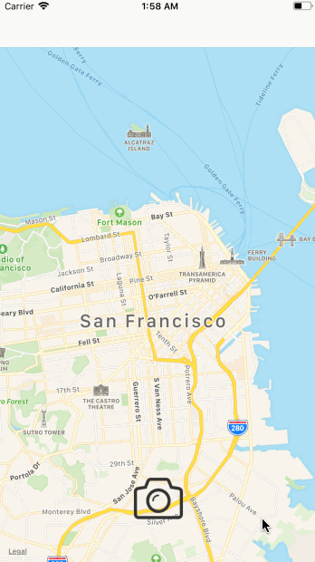

## My PhotoMap 
    
This is an application that allows the user to search for locations using the [Foursquare API](https://developer.foursquare.com/docs) and create a pin with an image annotation.
    
## User Stories
- [X] User can view a map of San Francisco    
- [X] User can take a photo or choose one from the library
- [X] User can tag a location to the photo via search
- [X] User can drop a pin on the map with image annotation
    
The following **stretch** stories have been implemented.
- [ ] User can click on the annotation's information button to see a full size image
- [ ] User can scroll around the full size image
- [ ] User can see the pin replaced with an image
    
## Walkthrough
    

